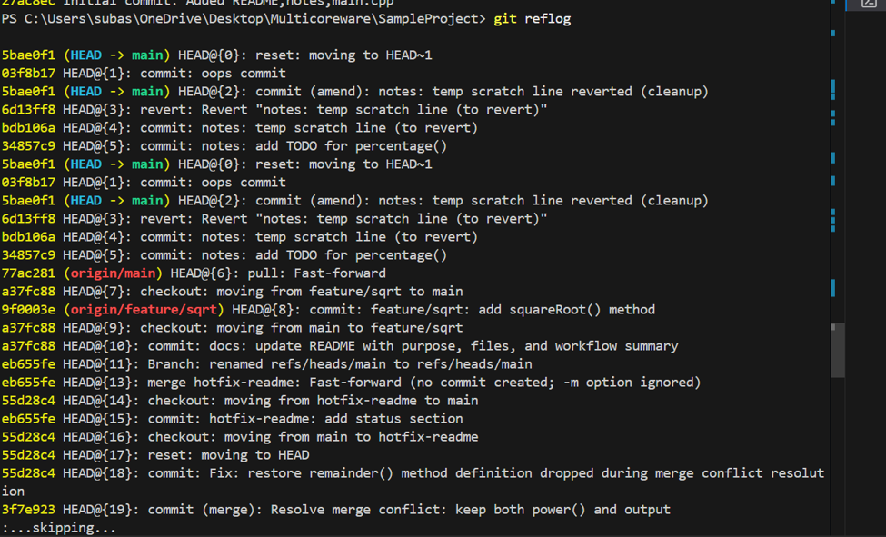
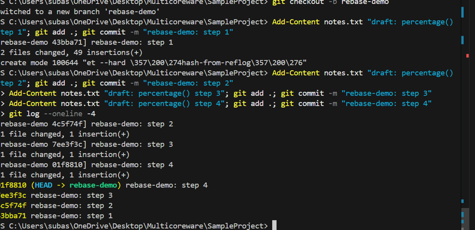
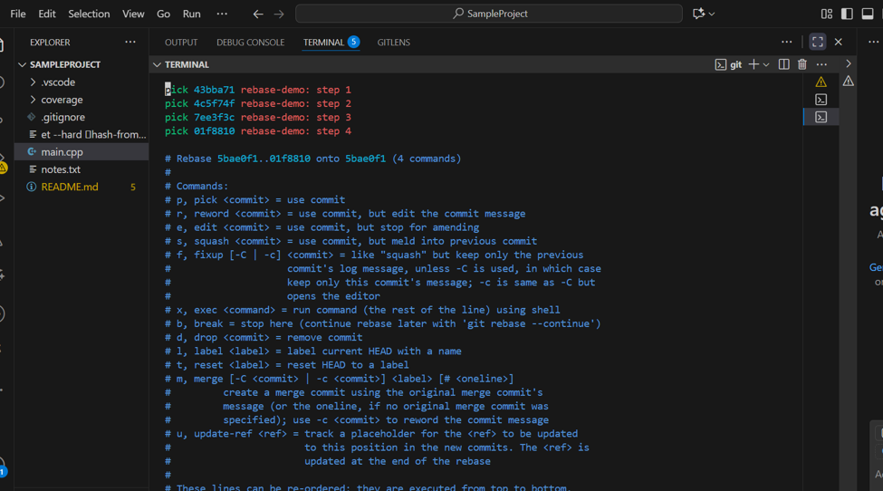

# Phase 2 Report 


## 1. git revert

Commands used:
```
git log --oneline
git revert --no-edit HEAD
git log --oneline
git commit --amend -m "notes: temp scratch line reverted (cleanup)"
```

Commit reverted: bdb106a 
New revert commit created: 5bae0f1

Explanation: git revert undoes a commit by creating a new commit instead of deleting the
old one. The old commit still stays in history. This is safer than git reset, because
reset can remove commits completely, which is risky if those commits were already pushed
and other people already have them.

---


## 2. git reflog

Commands used:
```
git log --oneline -3
git reset --hard HEAD~2
git log --oneline
git reflog
git reset --hard a72ba7a
git log --oneline
```

Explanation: After git reset --hard, the commit no longer appeared in git log. git reflog
showed the commit hash from before the reset, which was used to recover it.

Difference between git log and git reflog:
- git log shows commit history reachable from the current branch.
- git reflog shows every movement of HEAD (commits, resets, amends), even ones not visible
  in git log anymore. This is what makes recovery possible.



---

## 3. Interactive Rebase (squash) — rebase-demo branch

Commands used:
```
git checkout -b rebase-demo
git commit -m "rebase-demo: step 1"
git commit -m "rebase-demo: step 2"
git commit -m "rebase-demo: step 3"
git commit -m "rebase-demo: step 4"
git log --oneline -4
git rebase -i HEAD~4
git log --oneline -2
```

rebase (4 commits):





Explanation: The 4 commits were combined into a single commit using interactive rebase, by
marking the last 3 commits as "squash". This is useful to keep history clean before merging
into main.

---

## 4. git cherry-pick

Commands used:
```
git checkout -b feature-a
git commit -m "feature-a: add percentage() method"
git commit -m "feature-a: add refactor note (unrelated)"
git checkout main
git checkout -b feature-b
git cherry-pick 741e9be
git log --oneline -2
```

Commits on feature-a:
- 741e9be — feature-a: add percentage() method
- b439659 — feature-a: add refactor note (unrelated)

Commit cherry-picked into feature-b: 741e9be only

Explanation: feature-b only needed the percentage() method, not the unrelated refactor note.
Cherry-pick was used to move only that one commit instead of merging the whole branch.


---

## 5. Repository Cleanup

Commands used:
```
git checkout main
git merge feature-a --no-ff -m "Merge branch 'feature-a' into main"
git merge rebase-demo --no-ff -m "Merge branch 'rebase-demo' into main"
```

Merging rebase-demo caused a conflict in notes.txt. Resolved by keeping content from both
sides and removing the conflict markers.

```
git add notes.txt
git commit -m "Resolve merge conflict: combine notes from feature-a and rebase-demo"
```

Branch cleanup:
```
git branch -d feature-a rebase-demo
git branch -D feature-b
git branch
```


Tag:
```
git tag -a v1.0 -m "Release v1.0: calculator with add/subtract/multiply/power/divide/remainder/sqrt/percentage"
git push origin main
git push origin v1.0
```

Tag v1.0 confirmed on GitHub under the Tags page, on commit 7432e72.


---


## Final History

```
git log --oneline --graph --all
```


---

## What I found difficult


- Popping the stash caused a merge conflict, had to resolve it manually.
- One branch (feature/multiplication) had no commit on it because I forgot to commit before
  switching, had to delete it and create the branch again properly.
- During one conflict resolution, a method definition (remainder()) got accidentally removed,
  which caused a compile error. Had to find and re-add it.
- Understanding the difference between git log and git reflog took some practice, since
  git log did not show commits that git reflog could still find.
- During interactive rebase, part of Git's default comment text stayed in the final commit
  message by mistake.
